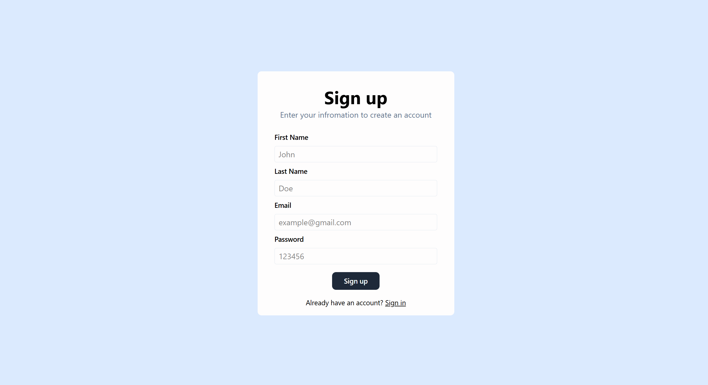
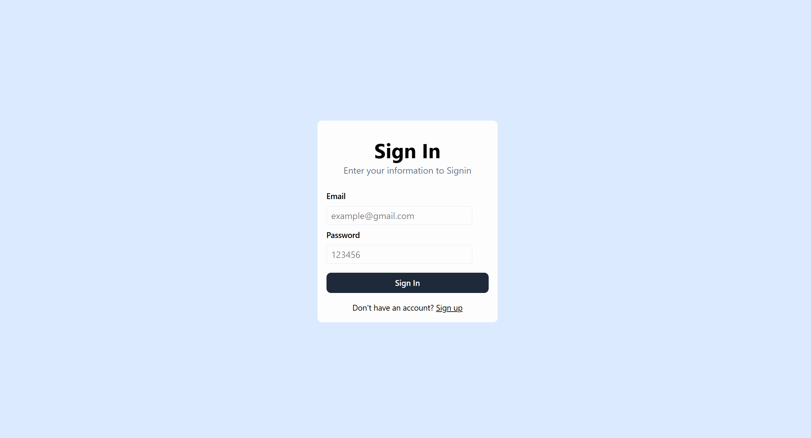
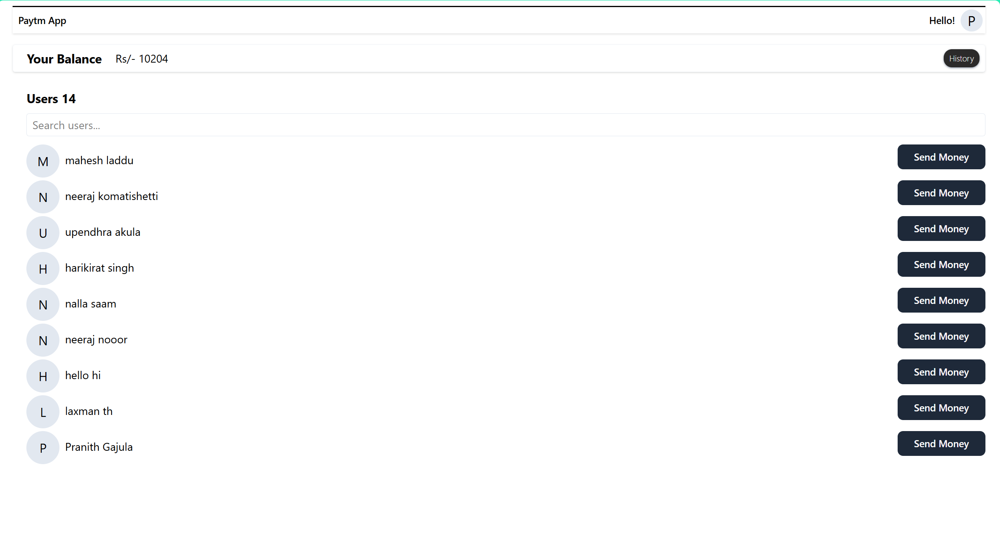
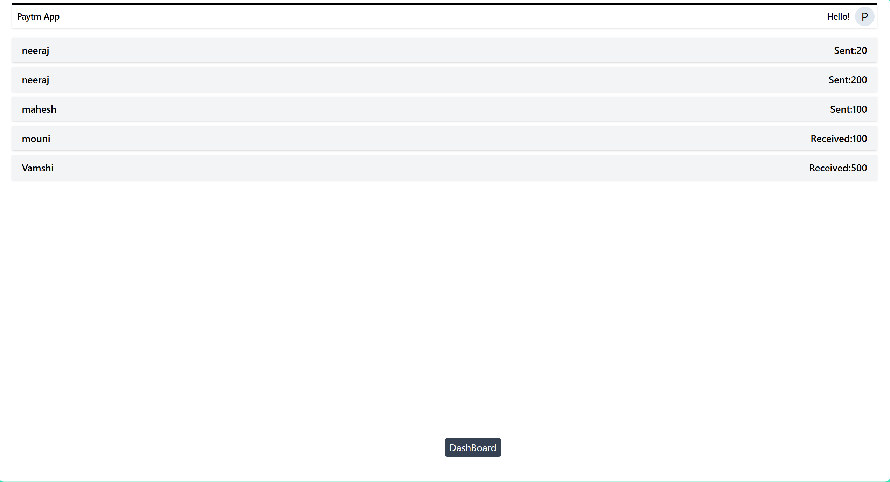

### PayTM Clone – Simple README

## Demo
- A minimal PayTM-style app with user signup/signin, balance view, user search, send money, and transaction history.

### Screenshots
- Signin:


- Signup:


- Dashboard:


- Send Money:


- History:


## Installation (Clone & Run)

### 1) Clone the repository
```bash
git clone https://github.com/Neerajkomatishetti/paytm-clone.git
cd your-repo/PayTM/paytm
```

### 2) Setup environment variables
Create a `.env` file in `paytm/backend`:
```bash
JWT_SECRET=your_jwt_secret_here
MONGODB_URL=mongodb://localhost:27017/paytm
PORT=3000
```

### 3) Install dependencies
- Backend:
```bash
cd backend
npm install
```

- Frontend:
```bash
cd ../frontend
npm install
```

### 4) Run the app (development)
- Start backend (port 3000):
```bash
cd ../backend
npm start
```

- Start frontend (Vite on 5173):
```bash
cd ../frontend
npm run dev
```

Open `http://localhost:5173`.

### 5) Build production frontend (optional)
```bash
cd paytm/frontend
npm run build
```
The backend serves `../frontend/dist` at `http://localhost:3000`.

### Notes
- Ensure MongoDB is running and accessible via `MONGODB_URL`.
- Update `MONGODB_URL` if using Docker/Atlas.
- API base: `http://localhost:3000/api/v1`
- Key files: `paytm/backend/index.js`, `paytm/backend/routes/`, `paytm/frontend/src/`
